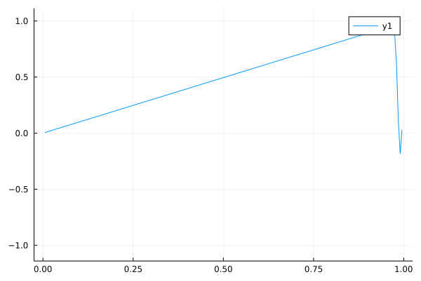

# Visualization for Partial Differential Equations

I made this repository to practice using Julia for solving and visualizing
partial differential equations. Right now there is only code for solving the
heat equation and wave equation in 1D with Dirichlet boundary conditions.

After getting your Julia environment set up, run
```bash
julia --project=. main.jl
```
to reproduce the plots.


## Heat Equation
### Case 1
Uniform 0 initial conditions, with both ends of the rod held at 1.

uₜ = uₓₓ

u(0, t) = u(10, t) = 1

u(x, 0) = 0


### Case 2
The initial condition is 1 everywhere, with the boundaries set to 0.

uₜ = uₓₓ

u(0, t) = u(10, t) = 0

u(x, 0) = 1


### Case 3
0 initial condition, with one boundary condition at zero and the other at 1.

uₜ = uₓₓ

u(0, t) = 0

u(10, t) = 1

u(x, 0) = 0


## Wave Equation
### Case 1
Standing sine wave.

uₜₜ = uₓₓ

u(0, t) = u(10, t) = 0

u(x, 0) = sin(π x / 5)

uₓ(x, 0) = 0


### Case 2
uₜₜ = 4 uₓₓ

u(0, t) = u(1, t) = 0

uₓ(x, 0) = -x

u(x, 0) = x

